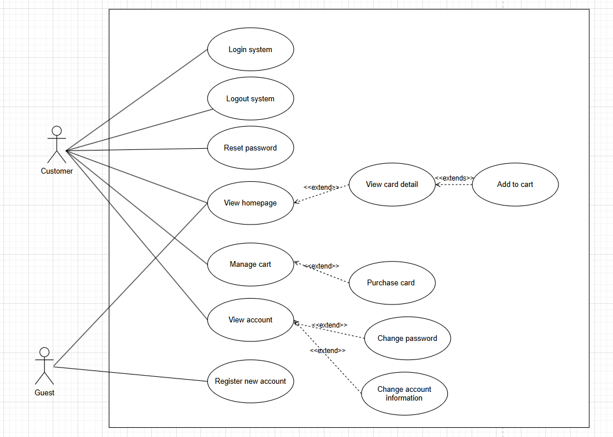
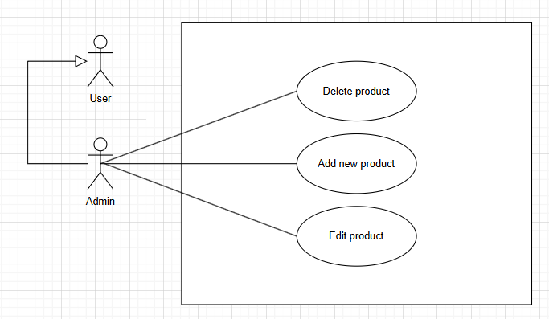
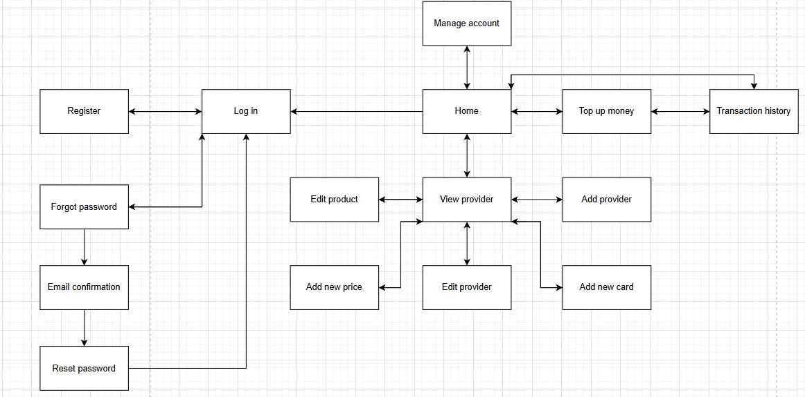
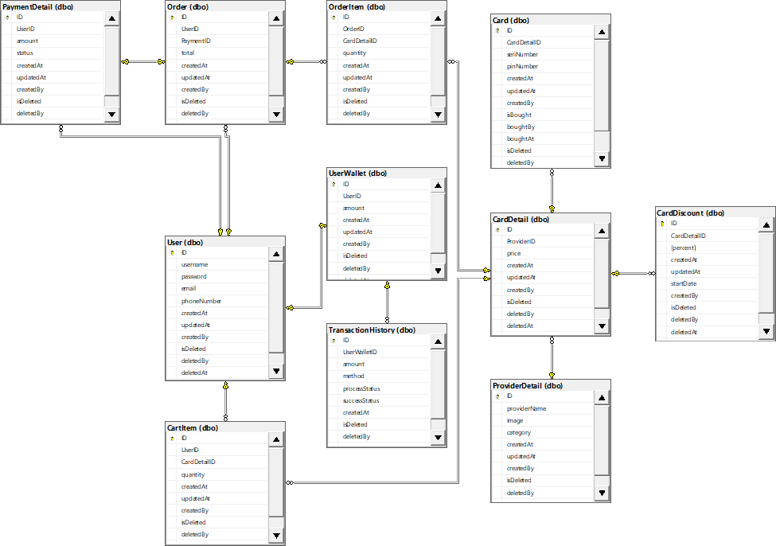

# **I. Overview**

## **1. Introduction**

### 1.1 Actors

| #   | Actor | Description |
|-----|-------|-------------|
| 1   | Guest | Can only view the homepage. |
| 2   | User  | Regular users can view account information, update personal details and passwords, purchase cards, and perform basic user functions. |
| 3   | Admin | Has all user permissions plus user management, edit account status, search accounts, and other administrative tasks. |

#### Table 1. Actors

### 1.2 Uses Cases

#### a.Use case diagram for user

#### Image 1. Use case diagram for user 

#### b.Use case diagram for admin

#### Image 2. Use case diagram for admin

## **2. System Functions**

### 2.1 Screen Flow

## 

#### Image 3. Screen flow

###  2.2 Screen Details

| #   | Feature         | Screen         | Description                                                                 |
|-----|-----------------|----------------|-----------------------------------------------------------------------------|
| 1   | Login           | Login          | Authenticate the user to access authorized features.                        |
| 2   | Forgot password | Forgot password| Render a form for email verification, then send a verification code.        |
| 3   | Confirmation    | Confirmation   | Display a form for users to enter the verification code received by email.  |
| 4   | Reset password  | Reset password | Allow users to set a new password after successful verification.            |
| 5   | Sign out        | Sign out       | Allow users to log out of the system.                                       |
| 6   | Home            | Home           | Main page where users can choose cards to buy.                              |
| 7   | Manage account  | Manage account | Admin can view the list of user accounts.                                   |
| 8   | View provider   | View provider  | Admin can view available cards and perform CRUD operations.                 |
| 9   | Edit provider   | Edit provider  | Admin can edit existing cards.                                              |
| 10  | Add provider    | Add provider   | Admin can add new cards.                                                    |
| 11  | Add card price  | Add card price | Admin can define new card prices.                                           |
| 12  | Add card        | Add card       | Admin can add cards to stock.                                               |
| 13  | Top up          | Top up page    | User can top up a custom amount of money.                                   |
| 14  | Transaction history | Transaction history | User can view their transaction history.                            |

#### 

### Table 2. Screen details

### 2.3 User Authorization

| Screen                | Admin | User | Guest |
|------------------------|:-----:|:----:|:-----:|
| Login                 |   X   |      |   X   |
| Forgot password       |   X   |      |   X   |
| Confirmation          |   X   |  X   |   X   |
| Reset password        |   X   |  X   |       |
| Sign out              |   X   |  X   |       |
| Sign in               |       |      |   X   |
| Homepage              |   X   |  X   |   X   |
| View provider         |   X   |  X   |   X   |
| Manage provider       |   X   |  X   |       |
| Add provider          |   X   |      |       |
| Edit provider         |   X   |      |       |
| Add card price        |   X   |      |       |
| Add card              |   X   |      |       |
| Top up                |   X   |  X   |       |
| Transaction history   |   X   |  X   |       |

## **3. System High-Level Design**

### 3.1 Database Design

#### Image 4. Database schema 

